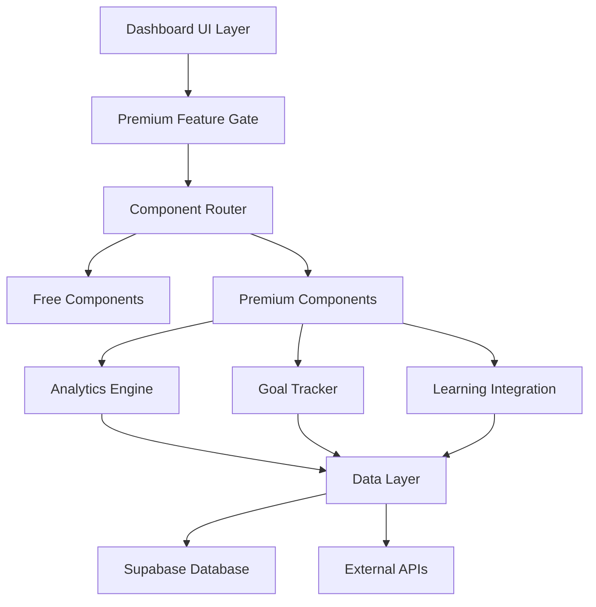

# Dashboard Premium Integration Design

## Overview

This design document outlines the architecture and implementation approach for integrating premium dashboard components into the existing InterpreLab dashboard system. The solution implements a feature-gated premium system with advanced analytics, goal tracking, and learning progress integration.

## Architecture

### High-Level Architecture



### Component Architecture

The dashboard will use a modular component architecture with clear separation between free and premium features:

- **Core Dashboard**: Base layout and navigation
- **Feature Gate System**: Premium access control
- **Component Library**: Reusable UI components
- **Data Management**: Centralized state and API management
- **Integration Layer**: External service connections

## Components and Interfaces

### Premium Feature Gate System

```typescript
interface PremiumFeatures {
  earningsProjection: boolean;
  goalsTracker: boolean;
  performanceHeatmap: boolean;
  platformComparison: boolean;
  advancedAnalytics: boolean;
}

interface PremiumContextType {
  isPremium: boolean;
  features: PremiumFeatures;
  subscriptionTier: 'free' | 'premium' | 'enterprise';
  upgrade: () => void;
  checkFeatureAccess: (feature: keyof PremiumFeatures) => boolean;
}
```

### Dashboard Layout System

The dashboard will use a responsive grid system that adapts based on subscription status:

- **Free Layout**: Basic components + premium previews
- **Premium Layout**: Full feature set with advanced analytics
- **Mobile Layout**: Optimized for mobile devices with collapsible sections
### Component Integration Strategy

#### Premium Component Wrapper
```typescript
interface PremiumComponentProps {
  isPremium: boolean;
  fallbackComponent?: React.ComponentType;
  upgradePrompt?: string;
}

const PremiumWrapper: React.FC<PremiumComponentProps> = ({
  isPremium,
  children,
  fallbackComponent: Fallback,
  upgradePrompt
}) => {
  if (isPremium) return <>{children}</>;
  return Fallback ? <Fallback /> : <UpgradePrompt message={upgradePrompt} />;
};
```

#### Data Flow Architecture
- **Centralized State**: Redux/Zustand for global dashboard state
- **Component State**: Local state for component-specific data
- **API Layer**: Abstracted API calls with error handling
- **Cache Layer**: Optimistic updates and offline support

## Data Models

### Goal Tracking System
```typescript
interface Goal {
  id: string;
  userId: string;
  title: string;
  description?: string;
  target: number;
  current: number;
  unit: 'dollars' | 'hours' | 'calls';
  type: 'daily' | 'weekly' | 'monthly' | 'yearly';
  deadline: Date;
  status: 'active' | 'completed' | 'paused' | 'cancelled';
  createdAt: Date;
  updatedAt: Date;
}
```

### Analytics Data Models
```typescript
interface EarningsProjection {
  month: string;
  actual?: number;
  projected: number;
  conservative: number;
  optimistic: number;
  confidence: number;
}

interface PerformanceHeatmap {
  userId: string;
  hour: number;
  dayOfWeek: number;
  calls: number;
  earnings: number;
  avgDuration: number;
  date: Date;
}

interface PlatformMetrics {
  platformName: string;
  totalCalls: number;
  totalEarnings: number;
  avgDuration: number;
  changePercent: number;
  period: 'week' | 'month' | 'quarter';
}
```

### Learning Integration Models
```typescript
interface LearningProgress {
  userId: string;
  studyHours: number;
  termsLearned: number;
  quizzesCompleted: number;
  scenariosPracticed: number;
  botConversations: number;
  currentStreak: number;
  longestStreak: number;
  lastActivity: Date;
}
```
## Error Handling

### Premium Feature Access Errors
- **Subscription Expired**: Graceful degradation to free features
- **Feature Not Available**: Clear messaging with upgrade options
- **API Failures**: Fallback to cached data or offline mode

### Data Loading States
- **Loading Skeletons**: Consistent loading states across components
- **Error Boundaries**: Component-level error isolation
- **Retry Mechanisms**: Automatic retry for transient failures

### Integration Failures
- **External API Errors**: Fallback to manual data entry
- **Sync Failures**: Queue for retry with user notification
- **Connection Issues**: Offline mode with sync on reconnection

## Testing Strategy

### Unit Testing
- **Component Testing**: React Testing Library for all components
- **Hook Testing**: Custom hooks with comprehensive test coverage
- **Utility Testing**: Pure functions and data transformations
- **Premium Gate Testing**: Feature access control logic

### Integration Testing
- **API Integration**: Mock external services for consistent testing
- **Database Operations**: Test data persistence and retrieval
- **Premium Flow**: End-to-end premium upgrade and feature access
- **Cross-Component**: Data flow between dashboard components

### Performance Testing
- **Bundle Size**: Monitor impact of new premium components
- **Rendering Performance**: Measure component render times
- **Memory Usage**: Track memory consumption with all features enabled
- **Mobile Performance**: Ensure smooth experience on mobile devices

### Accessibility Testing
- **Screen Reader**: Ensure all premium features are accessible
- **Keyboard Navigation**: Full keyboard accessibility
- **Color Contrast**: Meet WCAG guidelines for all components
- **Focus Management**: Proper focus handling in modals and forms
