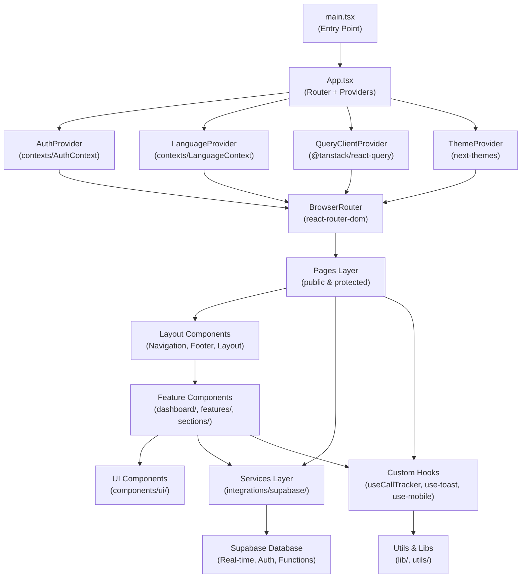
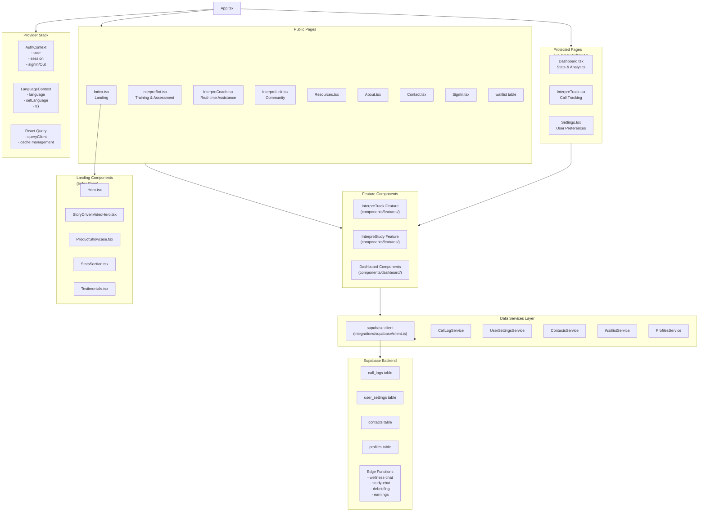
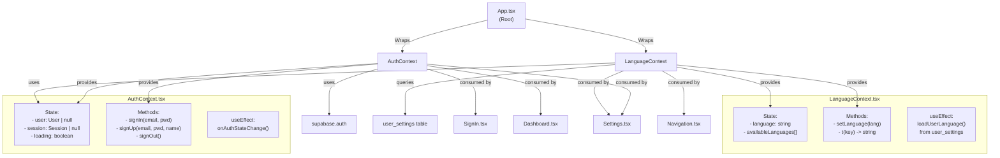
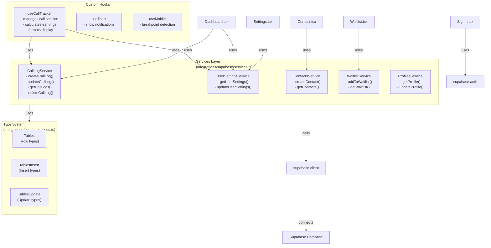
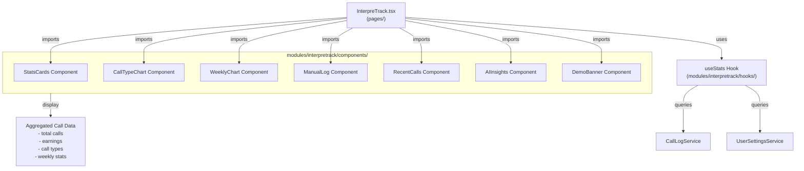
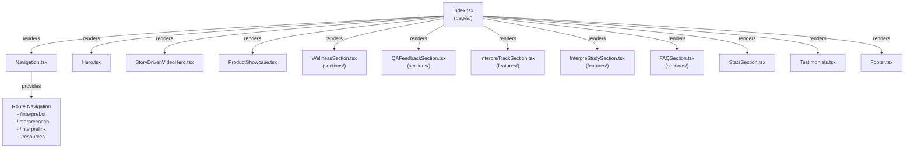
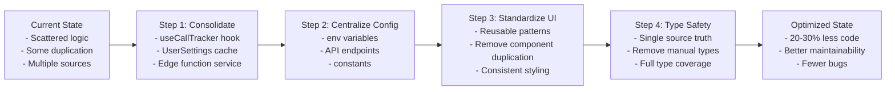

# InterpreLab Eco Landing Page - Architecture Flowmap

## Overview
This document maps file interconnections, data flows, and identifies redundant processes across the codebase.

---

## 1. Global Architecture Overview



---

## 2. Component Hierarchy & Data Flow



---

## 3. Data Flow: Call Tracking Example

```mermaid
graph LR
    User["User<br/>(InterpreTrack page)"]
    User -->|triggers| StartCall["Start Call Button"]
    StartCall -->|useCallTracker.startCall()| CallTracker["useCallTracker Hook"]
    CallTracker -->|calls| CallLogService["CallLogService.createCallLog()"]
    CallLogService -->|insert| Supabase["Supabase<br/>call_logs table"]

    Timer["Timer Running<br/>(interval: 1000ms)"]
    CallTracker -->|manages| Timer
    Timer -->|updates| ElapsedSeconds["elapsedSeconds state"]

    User -->|triggers| EndCall["End Call Button"]
    EndCall -->|useCallTracker.endCall()| CalcEarnings["Calculate Earnings"]
    CalcEarnings -->|uses| UserSettings["UserSettingsService<br/>get pay_rate"]
    UserSettings -->|query| SupabaseSettings["user_settings table"]
    CalcEarnings -->|update| CallLogService
    CallLogService -->|update| Supabase

    Supabase -->|emit| Dashboard["Dashboard page<br/>displays updated stats"]
```

---

## 4. Authentication & Protected Routes

```mermaid
graph TD
    BrowserRouter["BrowserRouter"]

    BrowserRouter -->|All Routes| Router["Routes<br/>(App.tsx)"]

    Router -->|Public| PublicRoutes["Public Routes<br/>- /<br/>- /interprebot<br/>- /interprecoach<br/>- /resources<br/>- /about<br/>- /signin<br/>- /waitlist"]

    Router -->|Protected| ProtectedRoutes["Protected Routes<br/>- /dashboard<br/>- /interpretrack<br/>- /call-tracker<br/>- /settings"]

    ProtectedRoutes -->|Wrapped in| ProtectedRoute["ProtectedRoute.tsx<br/>Component"]

    ProtectedRoute -->|Checks| AuthContext["AuthContext.user"]
    AuthContext -->|Loading?| ShowSpinner["Show Loading Spinner"]
    AuthContext -->|User? true| RenderPage["Render Protected Page"]
    AuthContext -->|User? false| Redirect["Navigate to /signin"]

    SignIn["SignIn Page"] -->|useAuth().signIn()| SupabaseAuth["Supabase Auth"]
    SupabaseAuth -->|success| SetSession["AuthContext.session updated"]
    SetSession -->|trigger| RerenderApp["App rerenders"]
    RerenderApp -->|user exists| AllowAccess["User can access protected routes"]
```

---

## 5. Context & Global State Management



---

## 6. Services & Data Access Layer



---

## 7. Module-Based Architecture: InterpreTrack



---

## 8. Landing Page Component Tree



---

## 9. Identified Redundancies & Optimization Opportunities

### 🔴 Critical Redundancies

#### 1. **Multiple Call Tracking Implementations**
- `useCallTracker.ts` (custom hook)
- `modules/interpretrack/` (module-based approach)
- Possible duplication in logic

**Recommendation:** Consolidate into single `useCallTracker` hook, re-export from hooks directory.

#### 2. **Dual Page Routes**
- `/interpretrack` and `/call-tracker` both render same component
- `/interpre-wellness` and `/interprewellbeing` aliasing

**Recommendation:** Keep single canonical route, redirect aliases to main route.

#### 3. **Multiple Service Calls for User Settings**
- `UserSettingsService.getUserSettings()` called in:
  - `LanguageContext.tsx` (on user change)
  - `useCallTracker.ts` (on mount)
  - `Settings.tsx` (page load)
  - Possibly multiple component re-renders

**Recommendation:** Cache in `AuthContext` or use React Query for centralized state.

#### 4. **Redundant UI Components**
- `components/ui/` has many shadcn/ui primitives
- Many pages duplicate similar card, button, badge patterns

**Recommendation:** Create reusable component library patterns (e.g., `DataCard`, `FormCard`, `StatsCard`).

### 🟡 Moderate Concerns

#### 5. **Edge Function Invocations**
- `wellness-chat`, `study-chat`, `debriefing-questionnaire`, `generate-earnings-projection`
- Each invoked separately from different components
- No centralized error handling or retry logic

**Recommendation:** Create unified `EdgeFunctionService` with error handling, caching, retry logic.

#### 6. **Environment Variable Dependencies**
- Multiple files reference `VITE_SUPABASE_URL`, `VITE_SUPABASE_ANON_KEY`
- Different env files (`.env`, `.env.local`, `.env.production`)

**Recommendation:** Centralize env config in `lib/env.ts` or `config.ts`.

#### 7. **Toast/Notification Duplication**
- `useToast()` called in many components (SignIn, Waitlist, Dashboard, Settings)
- Sonner and shadcn/ui toaster both imported in App.tsx

**Recommendation:** Document which one to use; consider removing one.

#### 8. **Type Redundancy**
- Supabase-generated `types.ts` is auto-generated
- Manual type definitions may exist in lib/types.ts

**Recommendation:** Single source of truth - use generated types exclusively.

### 🟢 Healthy Patterns (Keep)

✅ **Hooks for Business Logic** - `useCallTracker`, `useMobile`, `useToast` properly isolated
✅ **Context for Auth/i18n** - Right abstraction level
✅ **Service Layer** - Supabase CRUD centralized
✅ **React Query** - Good for server state caching
✅ **Protected Routes** - Proper access control pattern

---

## 10. Suggested Refactoring Plan



---

## 11. File Import Dependency Graph (Key Files)

```mermaid
graph TB
    App.tsx -->|imports| AuthContext
    App.tsx -->|imports| LanguageContext
    App.tsx -->|imports| Pages

    Dashboard.tsx -->|imports| AuthContext
    Dashboard.tsx -->|imports| supabase
    Dashboard.tsx -->|imports| utils

    InterpreTrack.tsx -->|imports| useStats
    InterpreTrack.tsx -->|imports| modules
    InterpreTrack.tsx -->|imports| components

    useCallTracker.ts -->|imports| UserSettingsService
    useCallTracker.ts -->|imports| CallLogService
    useCallTracker.ts -->|imports| AuthContext

    Settings.tsx -->|imports| AuthContext
    Settings.tsx -->|imports| LanguageContext
    Settings.tsx -->|imports| UserSettingsService

    SignIn.tsx -->|imports| AuthContext
    SignIn.tsx -->|imports| validations

    Waitlist.tsx -->|imports| WaitlistService
    Waitlist.tsx -->|imports| validations
```



---

## Summary Statistics

| Category | Count | Health |
|----------|-------|--------|
| Pages | 14 | ✅ Good separation |
| Components | 40+ | ⚠️ Some duplication |
| Services | 5 | ✅ Well organized |
| Contexts | 2 | ✅ Essential only |
| Custom Hooks | 3 | ✅ Focused purposes |
| Edge Functions | 4 | ⚠️ Needs wrapper |
| Data Tables | 8 | ✅ Type-safe |
| Redundant Patterns | 8 | 🔴 Needs refactor |

