# InterpreLab Project Structure

This document provides a visual representation of the entire project structure using Mermaid diagrams.

## Project Root Structure

```mermaid
graph TD
    Root["interprelab-eco-landing-page/"]
    
    Root --> Config["📄 Configuration Files"]
    Root --> Src["📁 src/"]
    Root --> Public["📁 public/"]
    Root --> Docs["📁 docs/"]
    Root --> Build["📁 dist/"]
    Root --> NodeModules["📁 node_modules/"]
    Root --> Supabase["📁 supabase/"]
    
    Config --> package["package.json"]
    Config --> tsconfig["tsconfig.json"]
    Config --> vite["vite.config.ts"]
    Config --> vitest["vitest.config.ts"]
    Config --> tailwind["tailwind.config.ts"]
    Config --> eslint["eslint.config.js"]
    Config --> index["index.html"]
    Config --> env[".env"]
    Config --> firebase["firebase.json"]
    
    Public --> favicon["favicon.svg"]
    Public --> logo["logo.png"]
    Public --> placeholder["placeholder.svg"]
    
    style Root fill:#2E5266,color:#fff
    style Src fill:#5FB3B3,color:#000
    style Config fill:#E8E8E8,color:#000
```

## Source Directory Structure

```mermaid
graph TD
    Src["src/"]
    
    Src --> Pages["📁 pages/ (16 files)"]
    Src --> Components["📁 components/ (78 children)"]
    Src --> Contexts["📁 contexts/ (2 files)"]
    Src --> Hooks["📁 hooks/ (3 files)"]
    Src --> Lib["📁 lib/ (5 files)"]
    Src --> Modules["📁 modules/ (20 children)"]
    Src --> Integrations["📁 integrations/"]
    Src --> Services["📁 services/ (1 file)"]
    Src --> Utils["📁 utils/ (7 files)"]
    Src --> Test["📁 test/ (2 files)"]
    Src --> Assets["📁 assets/"]
    
    Src --> AppTsx["App.tsx"]
    Src --> MainTsx["main.tsx"]
    Src --> IndexCss["index.css"]
    Src --> AppCss["App.css"]
    Src --> ViteEnv["vite-env.d.ts"]
    
    style Src fill:#5FB3B3,color:#000
    style Pages fill:#FFE5B4,color:#000
    style Components fill:#FFE5B4,color:#000
```

## Pages Directory

## Components Directory Structure

```mermaid
graph TD
    Components["components/"]
    
    Components --> UI["📁 ui/ (49 components)"]
    Components --> Landing["📁 landing/ (8 components)"]
    Components --> Features["📁 features/"]
    Components --> Sections["📁 sections/"]
    Components --> Dashboard["📁 dashboard/ (5 files)"]
    Components --> Dilemma["📁 dilemma/ (3 files)"]
    
    Components --> Navigation["Navigation.tsx"]
    Components --> Footer["Footer.tsx"]
    Components --> Layout["Layout.tsx"]
    Components --> ProtectedRoute["ProtectedRoute.tsx"]
    Components --> ExtensionUI["ExtensionUI.tsx<br/>(22KB)"]
    
    UI --> Button["button.tsx"]
    UI --> Card["card.tsx"]
    UI --> Badge["badge.tsx"]
    UI --> Dialog["dialog.tsx"]
    UI --> Dropdown["dropdown-menu.tsx"]
    UI --> Form["form.tsx"]
    UI --> Input["input.tsx"]
    UI --> Toast["toast.tsx"]
    UI --> Sonner["sonner.tsx"]
    UI --> More["... 40 more components"]
    
    Landing --> Hero["Hero.tsx"]
    Landing --> StoryVideo["StoryDrivenVideoHero.tsx"]
    Landing --> ProductShowcase["ProductShowcase.tsx"]
    Landing --> Certificates["CertificatesPremium.tsx"]
    Landing --> Testimonials["Testimonials.tsx"]
    Landing --> Stats["StatsSection.tsx"]
    
    Features --> InterpreTrackDir["📁 InterpreTrack/"]
    Features --> InterpreStudyDir["📁 InterpreStudy/"]
    
    Sections --> FAQ["📁 FAQ/"]
    Sections --> Wellness["WellnessSection.tsx"]
    Sections --> QAFeedback["QAFeedbackSection.tsx"]
    
    style Components fill:#FFE5B4,color:#000
    style UI fill:#E0F7FA,color:#000
    style Landing fill:#FFF9C4,color:#000
```

## Contexts & Hooks

## Integrations & Services

## Modules Directory

```mermaid
graph TD
    Modules["modules/<br/>(20 children)"]
    
    Modules --> InterpreTrack["📁 interpretrack/"]
    Modules --> OtherModules["... other business logic modules"]
    
    InterpreTrack --> TrackComponents["20 tracking-related files"]
    
    style Modules fill:#F8BBD0,color:#000
```

## Configuration Files Detail

## Complete File Tree Summary

## Key Statistics

- **Total Pages**: 16 route components
- **Total Components**: 78+ reusable components
- **UI Components**: 49 shadcn/ui components
- **Contexts**: 2 global state providers
- **Hooks**: 3+ custom hooks
- **Modules**: 20+ business logic modules
- **Largest File**: InterpreStudy.tsx (1,108 lines)
- **Lazy Loaded**: InterpreTrack.tsx

## Technology Stack Visualization

