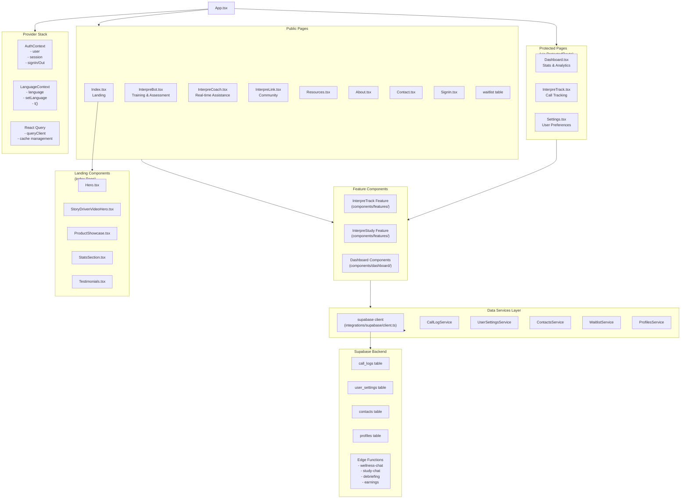

# 2. Component Hierarchy & Data Flow

```mermaid
graph TD
    AppRoot["App.tsx"]

    subgraph ProviderStack["Provider Stack"]
        AuthCtx["AuthContext<br/>- user<br/>- session<br/>- signIn/Out"]
        LangCtx["LanguageContext<br/>- language<br/>- setLanguage<br/>- t()"]
        ReactQuery["React Query<br/>- queryClient<br/>- cache management"]
    end

    subgraph PublicPages["Public Pages"]
        Index["Index.tsx<br/>Landing"]
        InterpreBot["InterpreBot.tsx<br/>Training & Assessment"]
        InterpreCoach["InterpreCoach.tsx<br/>Real-time Assistance"]
        InterpreLink["InterpreLink.tsx<br/>Community"]
        Resources["Resources.tsx"]
        About["About.tsx"]
        Contact["Contact.tsx"]
        SignIn["SignIn.tsx"]
        Waitlist["Waitlist.tsx"]
    end

    subgraph ProtectedPages["Protected Pages<br/>(via ProtectedRoute)"]
        Dashboard["Dashboard.tsx<br/>Stats & Analytics"]
        InterpreTrack["InterpreTrack.tsx<br/>Call Tracking"]
        Settings["Settings.tsx<br/>User Preferences"]
    end

    subgraph LandingComps["Landing Components<br/>(Index Page)"]
        Hero["Hero.tsx"]
        StoryVideo["StoryDrivenVideoHero.tsx"]
        ProductShowcase["ProductShowcase.tsx"]
        StatsSection["StatsSection.tsx"]
        Testimonials["Testimonials.tsx"]
    end

    subgraph FeatureComps["Feature Components"]
        InterpreTrackModule["InterpreTrack Feature<br/>(components/features/)"]
        InterpreStudyModule["InterpreStudy Feature<br/>(components/features/)"]
        DashboardModule["Dashboard Components<br/>(components/dashboard/)"]
    end

    subgraph DataServices["Data Services Layer"]
        SupabaseClient["supabase client<br/>(integrations/supabase/client.ts)"]
        CallLogService["CallLogService"]
        UserSettingsService["UserSettingsService"]
        ContactsService["ContactsService"]
        WaitlistService["WaitlistService"]
        ProfilesService["ProfilesService"]
    end

    subgraph Database["Supabase Backend"]
        CallLogs["call_logs table"]
        UserSettings["user_settings table"]
        Contacts["contacts table"]
        Waitlist["waitlist table"]
        Profiles["profiles table"]
        EdgeFunctions["Edge Functions<br/>- wellness-chat<br/>- study-chat<br/>- debriefing<br/>- earnings"]
    end

    AppRoot --> ProviderStack
    AppRoot --> PublicPages
    AppRoot --> ProtectedPages
    Index --> LandingComps
    PublicPages --> FeatureComps
    ProtectedPages --> FeatureComps
    FeatureComps --> DataServices
    DataServices --> SupabaseClient
    SupabaseClient --> Database
```
