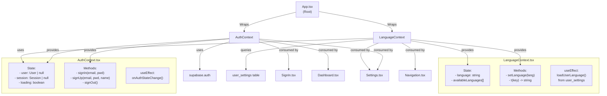

# 5. Context & Global State Management

```mermaid
graph TB
    App["App.tsx<br/>(Root)"]

    subgraph ContextA["AuthContext.tsx"]
        AuthState["State:<br/>- user: User | null<br/>- session: Session | null<br/>- loading: boolean"]
        AuthMethods["Methods:<br/>- signIn(email, pwd)<br/>- signUp(email, pwd, name)<br/>- signOut()"]
        AuthListener["useEffect:<br/>onAuthStateChange()"]
    end

    subgraph ContextB["LanguageContext.tsx"]
        LangState["State:<br/>- language: string<br/>- availableLanguages[]"]
        LangMethods["Methods:<br/>- setLanguage(lang)<br/>- t(key) -> string"]
        LangEffect["useEffect:<br/>loadUserLanguage()<br/>from user_settings"]
    end

    App -->|Wraps| AuthContext
    App -->|Wraps| LanguageContext
    AuthContext -->|provides| AuthState
    AuthContext -->|provides| AuthMethods
    AuthContext -->|uses| SupabaseAuth["supabase.auth"]

    LanguageContext -->|provides| LangState
    LanguageContext -->|provides| LangMethods
    LanguageContext -->|uses| AuthState
    LanguageContext -->|queries| UserSettings["user_settings table"]

    AuthContext -->|consumed by| SignIn["SignIn.tsx"]
    AuthContext -->|consumed by| Dashboard["Dashboard.tsx"]
    AuthContext -->|consumed by| Settings["Settings.tsx"]

    LanguageContext -->|consumed by| Navigation["Navigation.tsx"]
    LanguageContext -->|consumed by| Settings
```
