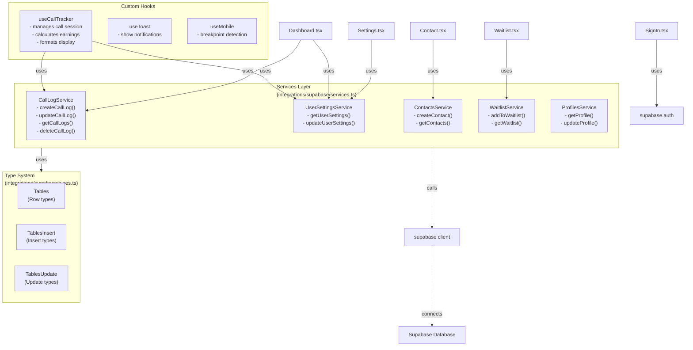

# 6. Services & Data Access Layer

```mermaid
graph TB
    subgraph Services["Services Layer<br/>(integrations/supabase/services.ts)"]
        CallLogSvc["CallLogService<br/>- createCallLog()<br/>- updateCallLog()<br/>- getCallLogs()<br/>- deleteCallLog()"]

        UserSettingsSvc["UserSettingsService<br/>- getUserSettings()<br/>- updateUserSettings()"]

        ContactsSvc["ContactsService<br/>- createContact()<br/>- getContacts()"]

        WaitlistSvc["WaitlistService<br/>- addToWaitlist()<br/>- getWaitlist()"]

        ProfilesSvc["ProfilesService<br/>- getProfile()<br/>- updateProfile()"]
    end

    subgraph Types["Type System<br/>(integrations/supabase/types.ts)"]
        Tables["Tables<br/>(Row types)"]
        Insert["TablesInsert<br/>(Insert types)"]
        Update["TablesUpdate<br/>(Update types)"]
    end

    subgraph Hooks["Custom Hooks"]
        CallTracker["useCallTracker<br/>- manages call session<br/>- calculates earnings<br/>- formats display"]
        Toast["useToast<br/>- show notifications"]
        Mobile["useMobile<br/>- breakpoint detection"]
    end

    CallTracker -->|uses| CallLogSvc
    CallTracker -->|uses| UserSettingsSvc

    Dashboard["Dashboard.tsx"] -->|uses| CallLogSvc
    Dashboard -->|uses| UserSettingsSvc

    SignIn["SignIn.tsx"] -->|uses| supabaseAuth["supabase.auth"]
    Waitlist["Waitlist.tsx"] -->|uses| WaitlistSvc
    Contact["Contact.tsx"] -->|uses| ContactsSvc
    Settings["Settings.tsx"] -->|uses| UserSettingsSvc

    Services -->|uses| Types
    Services -->|calls| SupabaseClient["supabase client"]
    SupabaseClient -->|connects| Database["Supabase Database"]
```
