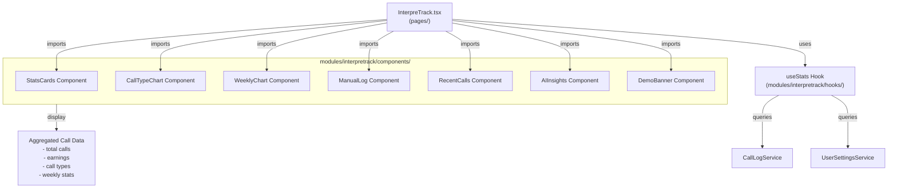

# 7. Module-Based Architecture: InterpreTrack

```mermaid
graph TB
    InterpreTrackPage["InterpreTrack.tsx<br/>(pages/)"]

    InterpreTrackPage -->|imports| StatsCards["StatsCards Component"]
    InterpreTrackPage -->|imports| CallTypeChart["CallTypeChart Component"]
    InterpreTrackPage -->|imports| WeeklyChart["WeeklyChart Component"]
    InterpreTrackPage -->|imports| ManualLog["ManualLog Component"]
    InterpreTrackPage -->|imports| RecentCalls["RecentCalls Component"]
    InterpreTrackPage -->|imports| AIInsights["AIInsights Component"]
    InterpreTrackPage -->|imports| DemoBanner["DemoBanner Component"]

    InterpreTrackPage -->|uses| useStats["useStats Hook<br/>(modules/interpretrack/hooks/)"]

    useStats -->|queries| CallLogService["CallLogService"]
    useStats -->|queries| UserSettingsService["UserSettingsService"]

    subgraph Dashboard["modules/interpretrack/components/"]
        StatsCards
        CallTypeChart
        WeeklyChart
        ManualLog
        RecentCalls
        AIInsights
        DemoBanner
    end

    Dashboard -->|display| Data["Aggregated Call Data<br/>- total calls<br/>- earnings<br/>- call types<br/>- weekly stats"]
```
