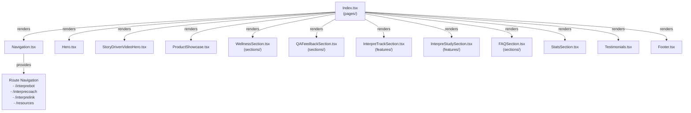

# 8. Landing Page Component Tree

```mermaid
graph TD
    Index["Index.tsx<br/>(pages/)"]

    Index -->|renders| Navigation["Navigation.tsx"]
    Index -->|renders| Hero["Hero.tsx"]
    Index -->|renders| StoryVideo["StoryDrivenVideoHero.tsx"]
    Index -->|renders| ProductShowcase["ProductShowcase.tsx"]
    Index -->|renders| WellnessSection["WellnessSection.tsx<br/>(sections/)"]
    Index -->|renders| QAFeedback["QAFeedbackSection.tsx<br/>(sections/)"]
    Index -->|renders| InterpreTrackSec["InterpreTrackSection.tsx<br/>(features/)"]
    Index -->|renders| InterpreStudySec["InterpreStudySection.tsx<br/>(features/)"]
    Index -->|renders| FAQSection["FAQSection.tsx<br/>(sections/)"]
    Index -->|renders| StatsSection["StatsSection.tsx"]
    Index -->|renders| Testimonials["Testimonials.tsx"]
    Index -->|renders| Footer["Footer.tsx"]

    Navigation -->|provides| NavLinks["Route Navigation<br/>- /interprebot<br/>- /interprecoach<br/>- /interprelink<br/>- /resources"]
```
