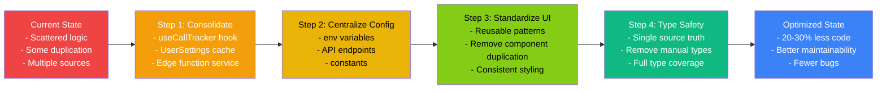

# 9. Refactoring Plan: Optimization Path

```mermaid
graph LR
    Current["Current State<br/>- Scattered logic<br/>- Some duplication<br/>- Multiple sources"]

    Step1["Step 1: Consolidate<br/>- useCallTracker hook<br/>- UserSettings cache<br/>- Edge function service"]

    Step2["Step 2: Centralize Config<br/>- env variables<br/>- API endpoints<br/>- constants"]

    Step3["Step 3: Standardize UI<br/>- Reusable patterns<br/>- Remove component duplication<br/>- Consistent styling"]

    Step4["Step 4: Type Safety<br/>- Single source truth<br/>- Remove manual types<br/>- Full type coverage"]

    Step5["Optimized State<br/>- 20-30% less code<br/>- Better maintainability<br/>- Fewer bugs"]

    Current --> Step1 --> Step2 --> Step3 --> Step4 --> Step5

    style Current fill:#ef4444,color:#fff
    style Step1 fill:#f59e0b,color:#fff
    style Step2 fill:#eab308,color:#000
    style Step3 fill:#84cc16,color:#000
    style Step4 fill:#10b981,color:#fff
    style Step5 fill:#3b82f6,color:#fff
```
