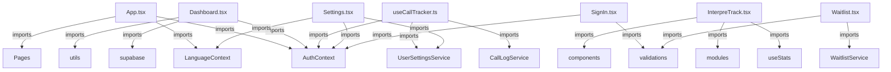

# 10. Key Files Import Dependencies

```mermaid
graph TB
    App.tsx -->|imports| AuthContext
    App.tsx -->|imports| LanguageContext
    App.tsx -->|imports| Pages

    Dashboard.tsx -->|imports| AuthContext
    Dashboard.tsx -->|imports| supabase
    Dashboard.tsx -->|imports| utils

    InterpreTrack.tsx -->|imports| useStats
    InterpreTrack.tsx -->|imports| modules
    InterpreTrack.tsx -->|imports| components

    useCallTracker.ts -->|imports| UserSettingsService
    useCallTracker.ts -->|imports| CallLogService
    useCallTracker.ts -->|imports| AuthContext

    Settings.tsx -->|imports| AuthContext
    Settings.tsx -->|imports| LanguageContext
    Settings.tsx -->|imports| UserSettingsService

    SignIn.tsx -->|imports| AuthContext
    SignIn.tsx -->|imports| validations

    Waitlist.tsx -->|imports| WaitlistService
    Waitlist.tsx -->|imports| validations
```
