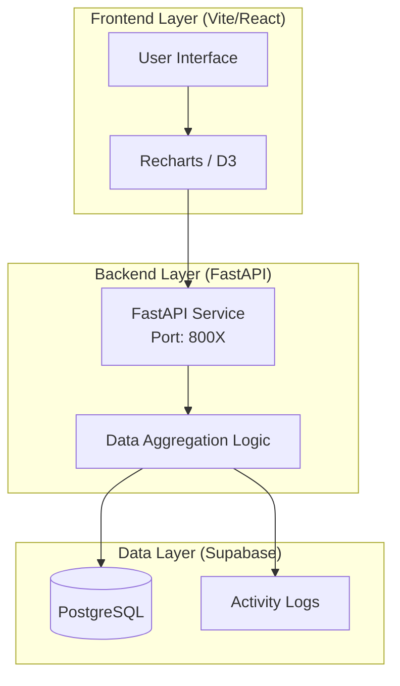

# InterpreTrack (Analytics Dashboard) Microservice

InterpreTrack provides deep insights into an interpreter's performance over time, visualizing metrics like accuracy trends, vocabulary growth, and session history.

## Architecture

This service follows a 3-layer architecture:



## Tech Stack

- **Frontend**: React, Recharts, Tailwind CSS
- **Backend**: Python (FastAPI), Pandas (for data processing)
- **Database**: Supabase (PostgreSQL)

## Getting Started

1. **Frontend**:

    ```bash
    npm install
    npm run dev
    ```

2. **Backend**:

    ```bash
    cd backend
    python -m venv venv
    ./venv/Scripts/activate
    pip install -r requirements.txt
    fastapi dev app/main.py
    ```
